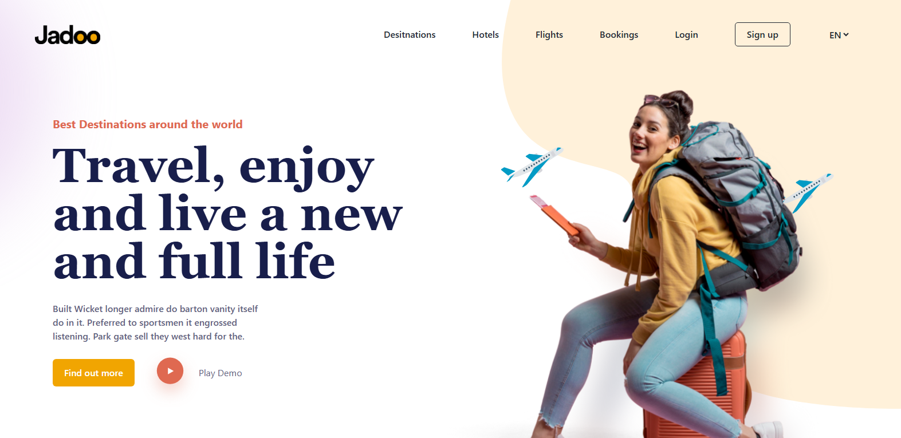

# Jadoo Travel Website landing page

A stunning travel landing page built with React and Tailwind CSS, featuring smooth and sleak, responsive design, and elements to showcase travel destinations.

✨ Features
Modern UI/UX Design

Clean, visually appealing layout with Tailwind CSS

Fully responsive for all devices

Smooth scrolling navigation

Travel Booking Components

Testimonial slider

Newsletter subscription

## Technologies Used
⚛️ React 18

🎨 Tailwind CSS

✨ Framer Motion (for animations)

📱 Fully responsive design

🚀 Vite (for fast development)

## Screenshot
 

## Live Demo
👉  https://jadoo-travel-alpha.vercel.app/

## Installation
Clone the repository

```bash
git clone https://github.com/yourusername/travel-landing-page.git
Install dependencies

```bash
npm install
Run the development server

```bash
npm run dev
Build for production

``bash
npm run build


## Customization
Change Content
Edit the data files in src/data/:

destinations.js - Featured travel spots

testimonials.js - Customer reviews

navbarLinks.js - Navigation items

Styling
Modify Tailwind classes in:

src/components/ - For individual components

Deployment
Push to GitHub

Import to Vercel/Netlify

Deploy!